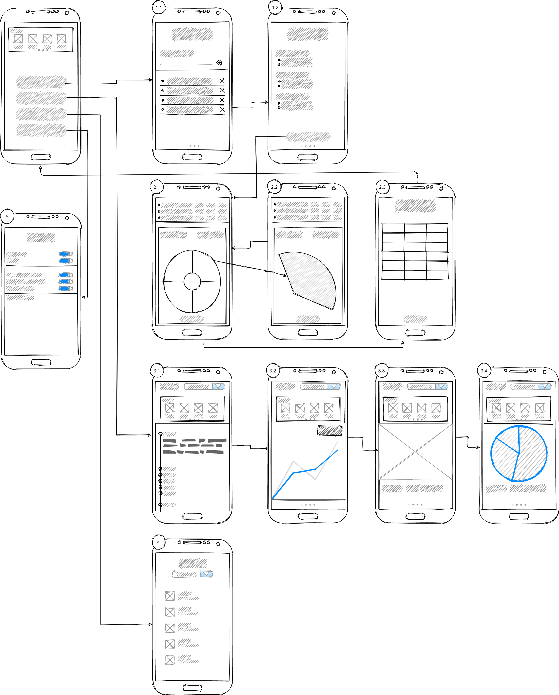

# DoubleOut

Android Dart Counter Application

## About the application

The **DoubleOut** app is a tool to track dart matches. It was developed as part of a cs course for 'mobile applications' @HSRM in Wiesbaden.
With this application you can do the following:

* track a dart match with other players
* add points fast and intuitivly
* select between different game settings and play modes
* play 1v1, against multiple players or against a simulation
* keep track of previous games
* get extensive statistics
* collect achievments

## Sitemap

### Overview of the screens

* 1.1 Game start screen: Add players
* 1.2 Game start screen: Game settings
* 2.1 Game overview: Add a dart throw
* 2.2 Game overview: Select a struck field on the dart board
* 2.3 Game overview: Scoreboard
* 3.1 Stats: Timeline of all games per player
* 3.2 Stats: Avg point development per player over time
* 3.3 Stats: Heatmap of most struck fields on the dart board per player
* 3.4 Stats: Distribution of scored points per player
* 4 Achievments: Overview of collected achievments per player
* 5 Settings: Overall app settings
